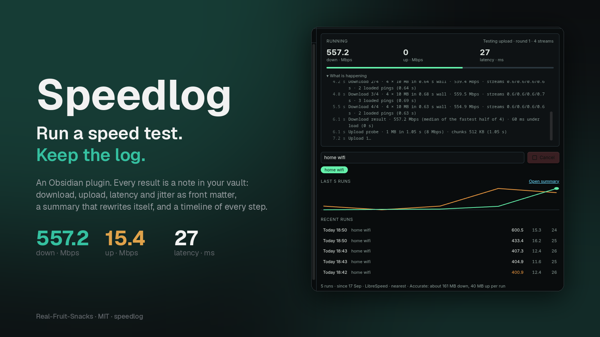
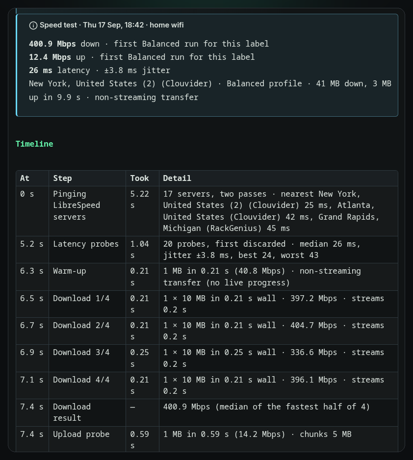
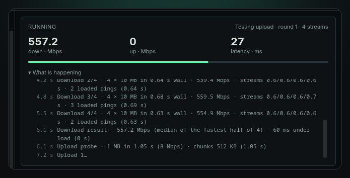
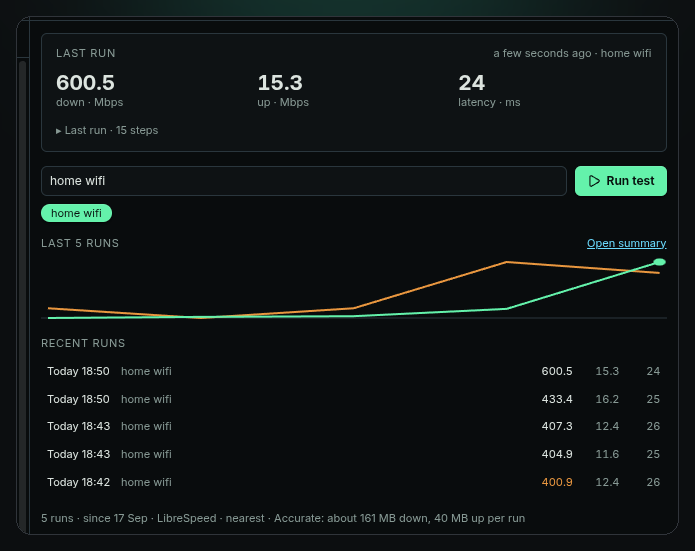
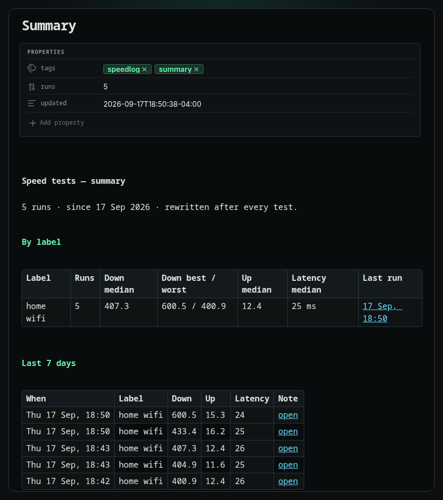
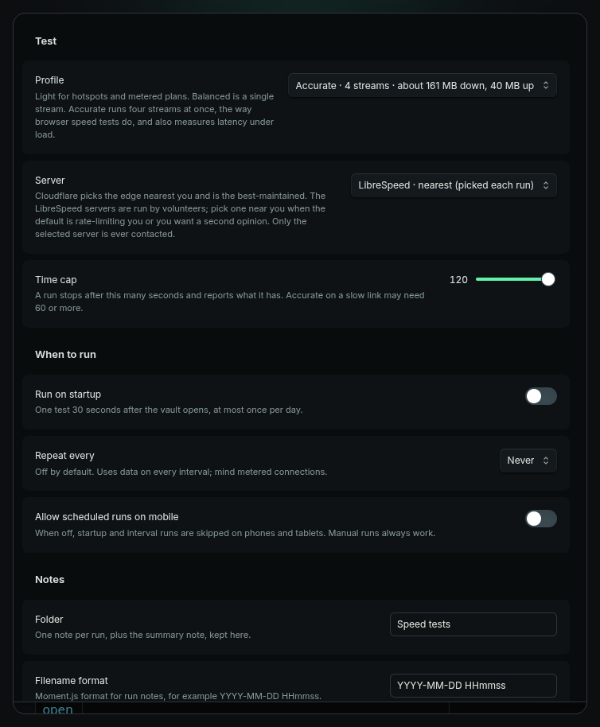

<p align="center">
  
</p>

<p align="center">
  <a href="https://github.com/Real-Fruit-Snacks/obsidian-speedlog/releases/latest"></a>
  <a href="LICENSE"></a>
  <a href="https://real-fruit-snacks.github.io/obsidian-speedlog/"></a>
  
</p>

# Speedlog

**Run an internet speed test from inside Obsidian and log every result as a note.**

A one-off speed test is a browser tab. A *log* tells you which network was slow, when it started, and whether the new router helped. Speedlog keeps that log where you already keep everything else: one Markdown note per run, numeric front matter you can chart with Bases or Dataview, a summary that rewrites itself, and a timeline of every step the test took.

## Highlights

- **Measured, not guessed.** Latency and jitter from up to 30 probes, then download and upload over four parallel streams the way browser speed tests do, with latency measured again while the link is saturated. Results are the median of the fastest half of each phase.
- **One note per run.** Front matter with `download_mbps`, `upload_mbps`, `latency_ms`, `jitter_ms`, `loaded_latency_ms`, `server`, `label`, `profile`, phase timings and more; a callout with the numbers and how they compare to the median for that network; a **Timeline** table of every step with its duration and what it found.
- **Labels.** Type "home wifi", "office", "phone hotspot" once and pick it from a chip next time. Medians, best and worst are tracked per label, so a hotspot never drags down your fibre.
- **`Summary.md`, rewritten after every run.** Per-label medians and extremes, failed runs with their reason, and the last seven days, every row linked to its note.
- **A panel that shows its work.** Last result, live progress, a step-by-step log while the test runs, a sparkline of recent runs and a list you can click through. The status bar shows the last numbers; click it to run again.
- **Your choice of server.** The nearest LibreSpeed public server, picked by ping at the start of each run (default), any of 17 by city, or Cloudflare's nearest edge.
- **Three profiles.** Accurate (default), Balanced (single stream) and Light (about 7 MB, for metered connections).
- **Honest failures.** Cancel any time. Rate limits, oversized-upload rejections and stalled links are handled and explained; a failed run gets its own note with the reason, so an outage is logged too.
- **Optional scheduling**, off by default: once a day on startup, or every N minutes, and never on mobile data unless you say so.

## How a run works

<p align="center"></p>

1. **Server.** With the default *LibreSpeed · nearest*, every public server is pinged in two passes and the quickest three are kept as candidates; if one refuses the test, the next is tried.
2. **Latency.** Up to 30 small requests; the first is discarded. The median is the latency; the mean gap between consecutive probes is the jitter.
3. **Warm-up.** One 1 MB transfer opens the connections.
4. **Download.** Four rounds of four parallel 10 MB transfers (Accurate). Each round reports its rate; the result is the median of the fastest half. Latency is probed during the transfers for the *under load* figure.
5. **Upload.** A 1 MB probe sizes the chunks for your uplink, then rounds run until a time budget is spent.
6. **Note and summary.** The run note is written, the metadata cache is waited for, and `Summary.md` is rebuilt.

Every step lands in the panel's log as it happens and in the note's Timeline afterwards, with `pick_s`, `latency_s`, `download_s` and `upload_s` in the front matter.

## Screenshots

| The panel mid-run | After a few runs |
|---|---|
|  |  |

| Summary.md | Settings |
|---|---|
|  |  |

The panel takes its colours from whatever theme you run; these were shot under Terminal Workbench.

## Install

From the community plugin directory, search for **Speedlog**.

Manually: download `main.js`, `styles.css` and `manifest.json` from the [latest release](https://github.com/Real-Fruit-Snacks/obsidian-speedlog/releases/latest) into `<vault>/.obsidian/plugins/speedlog/` and enable it under Settings → Community plugins. Works on desktop and mobile.

## Commands

| Command | What it does |
|---|---|
| **Run speed test** | Runs a test with the current label and writes the note. |
| **Open panel** | Opens the Speedlog sidebar. |
| **Open summary note** | Rebuilds and opens `Summary.md`. |

The ribbon gauge opens the panel; clicking the status bar item runs a test.

## Settings

| Setting | What it does |
|---|---|
| **Profile** | *Accurate* (default): four streams, about 160 MB down and 10–40 MB up, plus latency under load. *Balanced*: one stream, about 60 MB and 15 MB. *Light*: one 5 MB transfer, about 7 MB in total. |
| **Server** | *LibreSpeed · nearest* (default, picked each run), one of 17 LibreSpeed servers by city, or Cloudflare's nearest edge. |
| **Time cap** | A run stops after this many seconds and reports what it has. |
| **Run on startup** | One test 30 seconds after the vault opens, at most once a day. Off by default. |
| **Repeat every** | Never, or 30 minutes to 24 hours. Off by default. |
| **Allow scheduled runs on mobile** | Off: startup and interval runs skip phones and tablets. Manual runs always work. |
| **Folder** | Where run notes and `Summary.md` live. Default `Speed tests/`. |
| **Filename format** | Moment.js format for run notes. Default `YYYY-MM-DD HHmmss`. |
| **Keep Summary.md updated** | Rebuild the summary after every run. |
| **Status bar** | Show the last result in the status bar; click it to run again. |

## The run note

```yaml
---
download_mbps: 557.2
upload_mbps: 15.4
latency_ms: 27
jitter_ms: 2.6
loaded_latency_ms: 60
profile: accurate
label: "home wifi"
server: "New York, United States (2) (Clouvider)"
server_host: "nyc.speedtest.clouvider.net"
server_picked: auto
platform: "desktop · linux"
trigger: manual
duration_s: 12.1
pick_s: 2.5
latency_s: 0.9
download_s: 3.4
upload_s: 5.1
date: 2026-09-17T18:51:03-04:00
tags: [speedlog]
---
```

Below the front matter: the results callout, the **Timeline** table, the previous runs for that label, and a link to the summary. A failed run is written with `status: failed` and `error: "…"` instead of the numbers, and is excluded from medians.

## Charting the history

Any query tool works on the front matter. A Dataview table of the last 20 runs on one network:

```dataview
TABLE download_mbps AS "Down", upload_mbps AS "Up", latency_ms AS "ms", loaded_latency_ms AS "loaded"
FROM "Speed tests" WHERE label = "home wifi" AND !status SORT date DESC LIMIT 20
```

Or make a Base on the `Speed tests` folder and add a chart of `download_mbps` over `date`.

## Network and privacy

Speedlog contacts **one server per run**, and only while a test is running: the LibreSpeed server it picked (or the one you chose), or `speed.cloudflare.com`. The list of 17 LibreSpeed servers is embedded in the plugin, taken from [librespeed.org/backend-servers](https://librespeed.org/backend-servers), so the list itself is never fetched. Requests carry the test payload and nothing else; nothing about you or your vault leaves the device. The run note records which server was used.

Data per run at the default profile: about 160 MB down and 10–40 MB up (uploads are sized to your uplink). Use *Light* on metered connections. LibreSpeed servers are run by volunteers and may come and go; a server that refuses is skipped for the next nearest.

## Notes on accuracy

Speedlog measures what Obsidian itself can move on your connection at that moment. Wi-Fi, VPNs and whatever else is downloading all show up in it, which is the point of logging. Against different servers a minute apart, Speedlog's Cloudflare and LibreSpeed results agreed within a few percent during testing. Servers that don't allow cross-origin transfers are tested through Obsidian's own request path, which cannot stream progress; those runs show "non-streaming transfer" in the note and the progress bar advances per round rather than continuously.

## Contributing

Plain `main.js`, no build step. See [CONTRIBUTING.md](CONTRIBUTING.md). Before opening a pull request, run [Dev Lab](https://github.com/Real-Fruit-Snacks/obsidian-plugin-lab)'s pre-flight review on the plugin folder; it should report 0 linter errors.

## More from Real-Fruit-Snacks

[Thoughtbin](https://real-fruit-snacks.github.io/obsidian-Thoughtbin/) · [Theme Lab](https://real-fruit-snacks.github.io/obsidian-theme-lab/) · [Dev Lab](https://real-fruit-snacks.github.io/obsidian-plugin-lab/) · [Glow](https://real-fruit-snacks.github.io/obsidian-glow/) · [Outrun](https://real-fruit-snacks.github.io/obsidian-outrun/) · [Dossier](https://real-fruit-snacks.github.io/obsidian-dossier/) · [Comic](https://real-fruit-snacks.github.io/obsidian-comic/) · [Grimoire](https://real-fruit-snacks.github.io/obsidian-grimoire/)

## License

[MIT](LICENSE).
