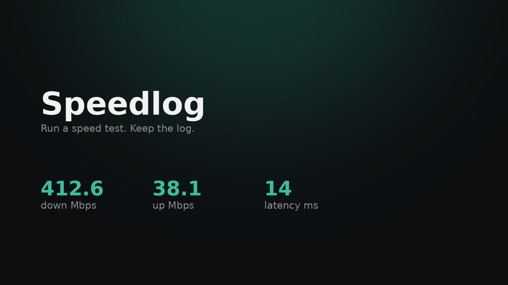

# Speedlog

**Run an internet speed test and log every result as a note.**

Speedlog measures download, upload, latency and jitter from inside Obsidian and writes each run to your vault as a Markdown note with front matter. Label runs ("home wifi", "office"), compare against the median for that label, chart the history with Bases or Dataview, and keep a summary note that rewrites itself after every test.



## Why

A one-off speed test is a browser tab. A *log* is something you keep: which network was slow, when it started, whether the new router helped. Speedlog keeps that log where you already keep everything else, as plain files you can query, chart and grep.

## What it does

- **Measures** latency and jitter, then download and upload, reporting the median of the fastest half. Three profiles: **Light** (one 5 MB transfer, about 7 MB per run, for hotspots and metered plans), **Balanced** (single stream, about 60 MB, the default) and **Accurate** (four parallel streams the way browser speed tests do, about 250 MB, plus latency measured while the link is saturated). A time cap stops long runs.
- **Logs one note per run** with front matter — `download_mbps`, `upload_mbps`, `latency_ms`, `jitter_ms`, `loaded_latency_ms` (Accurate only), `profile`, `label`, `server`, `platform`, `trigger`, `duration_s`, `date` — plus a callout with the numbers, how they compare to the median for that label, and the previous runs.
- **Keeps `Summary.md` updated**: runs, median, best and worst per label, and the last 7 days, with links to each note.
- **Sidebar panel**: last result, a label field with recent labels as chips, live progress during a run, a sparkline of recent runs, and a list of recent runs that opens each note.
- **Status bar** shows the last result; click it to run again.
- **Scheduling**, all off by default: run on startup (once a day, 30 s after the vault opens) and repeat every N minutes. Scheduled runs are skipped on phones and tablets unless you allow them.

## Network

Speedlog contacts exactly one host, `speed.cloudflare.com`, and only when a test runs. Nothing is sent except the test payload; nothing about you or your vault leaves the device. Per run: Light about 5 MB down and 2 MB up, Balanced about 60 MB and 15 MB, Accurate about 250 MB and 80 MB. Medians are compared within the same label *and* profile, so a Light run never drags down an Accurate one.

## Install

From the community plugin directory, search for **Speedlog**. Or manually: download `main.js`, `styles.css` and `manifest.json` from the [latest release](https://github.com/Real-Fruit-Snacks/obsidian-speedlog/releases/latest) into `.obsidian/plugins/speedlog/` and enable it under Settings → Community plugins.

## Commands

- **Run speed test**
- **Open panel**
- **Open summary note**

## Settings

- **Profile** — Light, Balanced or Accurate (see above).
- **Time cap** — A run stops after this many seconds and reports what it has. Accurate on a slow link may need 60 or more.
- **Run on startup** — One test 30 seconds after the vault opens, at most once per day.
- **Repeat every** — Off by default. Uses data on every interval.
- **Allow scheduled runs on mobile** — When off, startup and interval runs are skipped on phones and tablets. Manual runs always work.
- **Folder** — One note per run, plus the summary note, kept here. Default `Speed tests/`.
- **Filename format** — Moment.js format for run notes. Default `YYYY-MM-DD HHmmss`.
- **Keep Summary.md updated** — Rewritten after every run.
- **Status bar** — Show the last result; click it to run again.

## Charting the history

Every run note has numeric front matter, so any query tool works. A Dataview table of the last 20 runs on one network:

```dataview
TABLE download_mbps AS "Down", upload_mbps AS "Up", latency_ms AS "ms"
FROM "Speed tests" WHERE label = "home wifi" SORT date DESC LIMIT 20
```

Or make a Base on the `Speed tests` folder and add a chart of `download_mbps` over `date`.

## Notes

The measurement is a plain HTTP transfer timed in the app, so it reflects what Obsidian itself can do on your connection at that moment, not a lab number. Wi-Fi, VPNs and whatever else is downloading all show up in it — which is the point of logging.

## License

[MIT](LICENSE).
